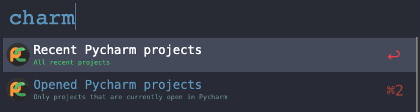
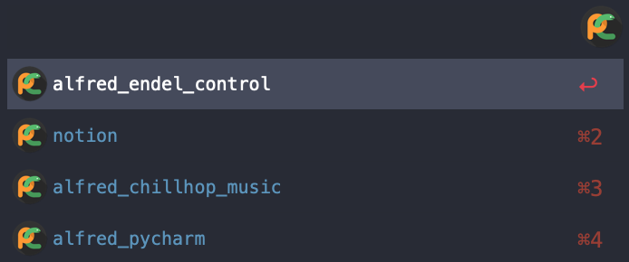

## Yet another Alfred Pycharm Workflow

This workflow allows a fast access to your recent and opened Pycharm projects without launching a new instance of
 Pycharm.

Download the [workflow here](https://github.com/denpy/yaapw/raw/main/pycharm_projects.alfredworkflow).

Just type **"charm"** in Alfred:

Choose on of the options to see you opened or recent projects:

Notes:
- Tested with PycharmCE 2020.2 and Alfred 4.1.1.
- This workflow requires Python 3.7 or later, if it's not in your `PATH` set `YAAPW_PYTHON_PATH` environment variabe to
 the Python executable path.
- This Workflow uses AppleScript too, so make sure all needed permissions are set.

Icon by [Aquatikguru](https://www.kindpng.com/userpngs/3697/)
